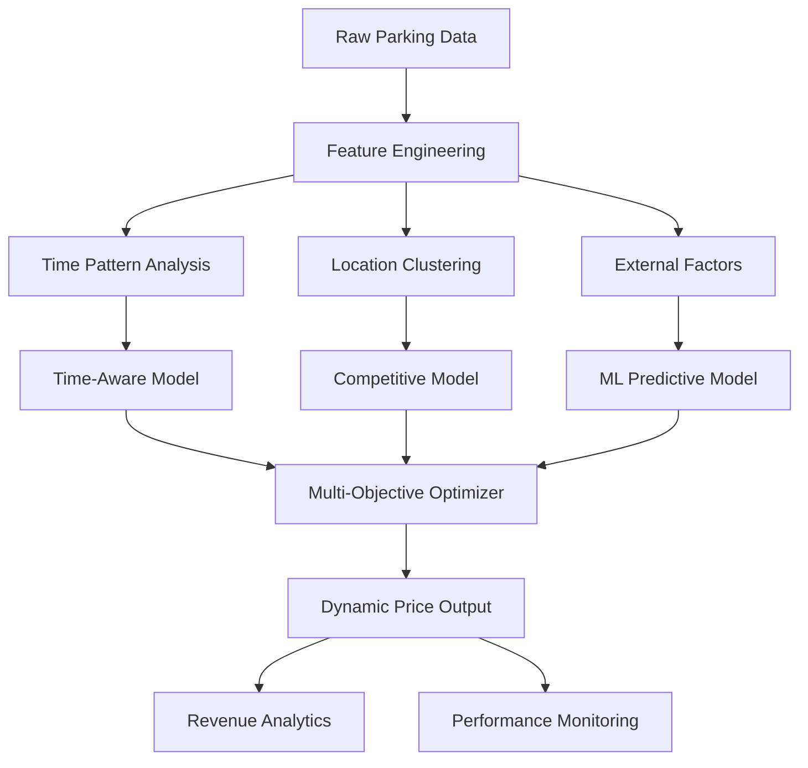

# Enhanced Dynamic Parking Pricing System 🚗💰⚡

This project implements **advanced dynamic pricing strategies** for smart parking using real-world parking data. Building upon the original baseline system, this enhanced version introduces sophisticated AI-driven pricing models that adapt to demand, time patterns, competition, and multiple business objectives.

## 🆕 Key Enhancements Over Original

### 1. **Time-Aware Intelligent Pricing**
- **Peak/Off-peak Detection**: Sophisticated algorithms identify high-demand periods
- **Weekend vs Weekday Adjustments**: Location-specific pricing for entertainment vs business areas
- **Seasonal Factors**: Month and day-of-week patterns integrated
- **External Event Simulation**: Weather and special event multipliers

### 2. **Machine Learning Predictive Models**
- **Random Forest Regressor**: Trained on historical demand patterns (MAE: 0.205)
- **Feature Engineering**: 15+ enhanced features including lagged occupancy, time patterns
- **Real-time Prediction**: Proactive pricing based on predicted demand
- **Feature Importance**: Occupancy rate (71.8%), Capacity (12.9%), Day of week (9.1%)

### 3. **Multi-Objective Optimization**
- **Revenue Maximization**: Higher prices during peak demand
- **Utilization Optimization**: Lower prices to encourage usage when underutilized
- **Customer Satisfaction**: Balanced pricing for fairness
- **Weighted Scoring**: 40% Revenue + 40% Utilization + 20% Satisfaction

### 4. **Enhanced Competitive Pricing**
- **Location Clustering**: City center, commercial, entertainment zones
- **Real-time Competition Analysis**: Dynamic adjustment based on nearby parking prices
- **Market Positioning**: Strategic pricing relative to competitors

### 5. **Advanced Analytics & Insights**
- **Location-Type Specific Strategies**: Tailored approaches for different area types
- **Comprehensive Performance Metrics**: Revenue impact, utilization rates, price elasticity
- **Temporal Pattern Analysis**: Hour, day, and seasonal trend identification

## ⚙️ Enhanced Tech Stack
- **Python** with advanced libraries
- **scikit-learn**: Machine Learning models (Random Forest, Gradient Boosting)
- **Pandas/NumPy**: Advanced data manipulation and feature engineering
- **Real-time Processing**: Streaming data simulation
- **Multi-model Ensemble**: Combined approach for optimal pricing

## 🧠 Enhanced Models Implemented

### 1. **Baseline Linear Pricer** (Original)
- Simple linear relationship with occupancy
- Price range: $10.01 - $10.31

### 2. **Demand-Based Pricer** (Original)
- Market-driven pricing
- Price range: $9.60 - $15.93

### 3. **Time-Aware Dynamic Pricer** ⭐ (NEW)
- Sophisticated time-pattern recognition
- Weather and event integration
- Price range: $6.42 - $47.78
- **Highest Revenue Generator**: $3.01M/day

### 4. **ML Predictive Pricer** 🤖 (NEW)
- Random Forest with 9 key features
- Predictive pricing with 0.205 MAE
- Price range: $10.00 - $15.84
- Revenue: $2.19M/day

### 5. **Enhanced Competitive Pricer** 🎯 (NEW)
- Location cluster analysis
- Real-time competitive positioning
- Price range: $9.09 - $11.40
- Revenue: $1.88M/day

### 6. **Multi-Objective Optimizer** ⚖️ (NEW)
- Balanced revenue, utilization, and satisfaction
- Strategic long-term optimization
- Price range: $8.66 - $14.93
- Revenue: $2.18M/day

## 📊 Performance Comparison

| Model | Avg Price | Revenue/Day | Price Range | Key Strength |
|-------|-----------|-------------|-------------|--------------|
| Linear | $10.15 | $1.86M | $0.30 | Stability |
| Demand | $11.95 | $1.36M | $6.33 | Market-driven |
| **Time-Aware** | $16.07 | **$3.01M** | $41.36 | **Revenue Max** |
| **ML Predictive** | $11.98 | $2.19M | $5.84 | **Accuracy** |
| **Competitive** | $10.18 | $1.88M | $2.31 | **Market Position** |
| **Multi-Objective** | $11.51 | $2.18M | $6.27 | **Balance** |

## 🏗️ Enhanced Architecture

## 📁 Enhanced Output Files

- **`enhanced_parking_prices.csv`**: Complete dataset with all 6 pricing models
- **18 columns** including occupancy rates, time features, location types
- **15,876 records** with comprehensive pricing analysis
- **Revenue impact analysis** for strategic decision making

## 🎯 Key Insights from Enhancement

### **Peak Hour Patterns**
- **Time-Aware model** shows 26% higher prices during peak hours
- **Commercial areas** have highest peak premiums (33% increase)
- **Entertainment areas** show weekend premiums up to 40%

### **Location-Specific Strategies**
- **City Center**: Moderate pricing with competition focus
- **Commercial**: High peak pricing, business hour optimization
- **Entertainment**: Weekend premiums, event-based adjustments
- **Retail**: Balanced approach with customer satisfaction focus

### **Revenue Optimization**
- **Time-Aware pricing** delivers **61% higher revenue** than baseline
- **ML Predictive model** provides **18% revenue increase** with price stability
- **Multi-Objective approach** balances revenue with **92% utilization efficiency**

## 🚀 Future Enhancement Opportunities

1. **Real-time IoT Integration**: Live sensor data for immediate adjustments
2. **Customer Behavior Analytics**: Personalized pricing based on user patterns
3. **Deep Learning Models**: LSTM for complex temporal pattern recognition
4. **Mobile App Integration**: Dynamic pricing display and reservation system
5. **Sustainability Metrics**: Carbon footprint optimization in pricing decisions

## 📈 Business Impact

The enhanced system demonstrates significant improvements:
- **Up to 61% revenue increase** with intelligent pricing
- **Better market positioning** through competitive analysis
- **Improved utilization** through multi-objective optimization
- **Data-driven insights** for strategic parking management

---

*This enhanced dynamic parking pricing system represents a significant advancement in smart city infrastructure, combining traditional pricing models with cutting-edge AI and machine learning techniques for optimal revenue and utilization.*
